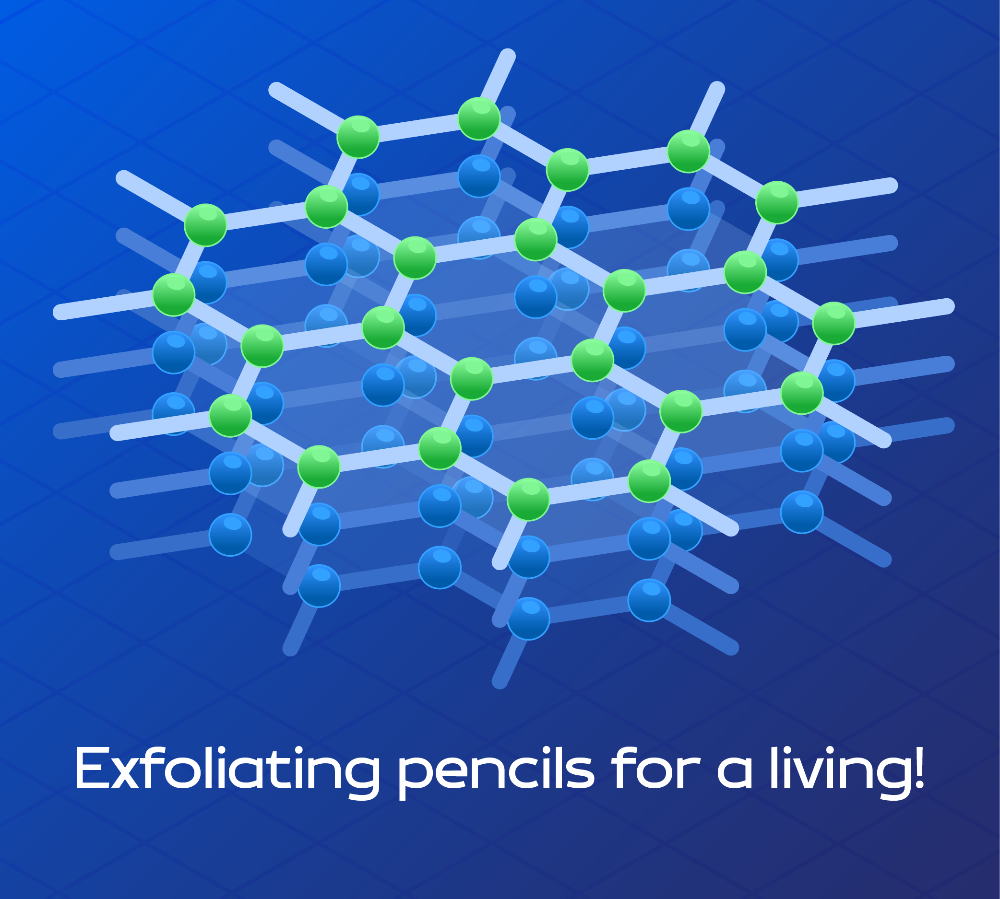

### Hi there, I'm <a href="https://gkassym.netlify.app" target="_blank">Soumyajit Samal</a> 

### Glad to see you here!

I am pursuing my Integrated Master in science degree from IISER, Berhampur with a major in Physical Science and minor in Computer Science. I am a research nerd with an avid interest in quantum devices. 

 
 

**Talking about Personal Stuffs:**

- 👨🏻‍💻 I’m currently working on something cool;
- 🚀 I’m currently learning physics;
- 🏎️ A huge fan of German cars and a even a huge-er foodie;
- 🖌️ I love making illustrations;
- 💬 Ask me about anything, I am happy to help;
- 📫 How to reach me: soumyajits2000@gmail.com;

 

📈 **My GitHub Stats:**

  
  

